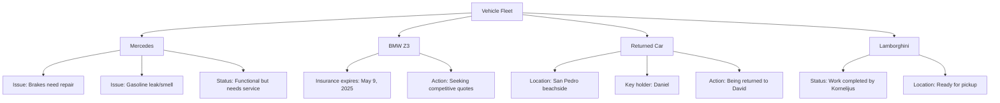

# Daily WhatsApp Resource Analysis
**For:** Ace Blond (Jernberg)  
**Date:** March 4, 2025

## 📊 Executive Summary

Today's communications reveal an intensely active day for Ace spanning business meetings, project coordination, client services, and resource management. Key highlights include:

- **Critical Scheduling**: Two concurrent 18:00 commitments required coordination (online business meeting and garage meeting)
- **Client Services**: Quick arrangement of specialized personal services for a high-priority client
- **Vehicle Portfolio**: Management of multiple vehicles with maintenance/documentation issues
- **Team Coordination**: Active coordination with team members Veli (software/AI), Casper (videography), and others

## ⏱️ Time Commitments Tracked

| Time | Commitment | Associated Parties | Status |
|------|------------|-------------------|--------|
| **18:00** | Strategic online meeting via Google Meet | Erik Wikström, Johan, Elias | Completed - Pitch deck template received |
| **18:00** | Garage meeting | Kornelijus | Confirmed - Lamborghini work completed |
| **Evening** | Website development session | Danis, Veli | Scheduled |
| **Evening** | Potential dinner with clients | Benny + girlfriend | Tentative (either today or Thursday) |
| **March 5 (Afternoon)** | Training session | P.S. | Confirmed |
| **March 6 (19:00)** | Dinner at Moroccan restaurant | P.S., Dani | Confirmed |
| **March 8 (Friday)** | Invoice submission deadline | Toñi Rmm Consulting | Pending - Claims already sent |

## 🚗 Vehicle Resource Management

### Vehicle Status Notes:
- **Mercedes**: Functioning despite brake issues and gasoline smell - requires immediate attention for safety
- **BMW Z3**: Insurance renewal pending (expiring May 9) - Pedro Moreno obtaining competitive quotes
- **Returned Vehicle**: Located in San Pedro beachside, key with Daniel (+34 696 34 68 45)
- **Lamborghini**: Work completed by Kornelijus, ready for delivery/collection

## 🏢 Property/Location Resources

| Location | Purpose | Activities | Notes |
|----------|---------|------------|-------|
| Office | Business headquarters | Meetings, website development | Danis will visit for website work with Veli |
| Garage | Vehicle maintenance | Vehicle servicing, Lamborghini completion | Meeting point with Kornelijus at 18:00 |
| Villa/House | Residence | Security coordination | Reference to calling security from house |
| New Build | Development project | Planning | 441 square meters + additional underground space |

## 👥 Human Resource Allocation

- **Veli**: Working on website development and AI solutions; also creating logo designs for Mfinity
- **Casper**: Video production; mentioned briefly regarding transportation
- **Kornelijus**: Vehicle specialist; completed work on Lamborghini
- **Danis**: Working on website development; managing catering and social arrangements
- **External Service Provider**: Arranged for client entertainment (+34 603 13 09 91)

## 💰 Financial Commitments & Discussions

| Item | Details | Status | Next Steps |
|------|---------|--------|------------|
| Jan/Feb Invoices | Required by Toñi Rmm Consulting | Ace believes already submitted | Verify submission by Friday deadline |
| BMW Z3 Insurance | Current policy expiring May 9 | Pedro Moreno seeking quotes | Compare options when received |
| Client Entertainment Services | Arranged through network | Completed | Ensure client satisfaction/follow-up |
| Document shipping | Materials being sent to office | Re-sent after previous delay | Monitor for arrival |

## ⚠️ Resource Conflicts & Risk Areas

1. **Scheduling Conflict**: Simultaneous 18:00 commitments for online meeting and garage meeting required careful time management
2. **Document Delays**: Ongoing issues with mail/shipping system affecting business operations
   - Ace expressed frustration: *"Sjuka är att allt alltid tar så lpng tid här, inget är digitalt"* (Crazy how everything always takes so long here, nothing is digital)
3. **Vehicle Safety Concerns**: Mercedes operating with brake issues and gasoline smell poses potential safety risk
4. **Project Timeline Risk**: Communication with Alejandro indicates significant delay (April 21) marked with alarm (💀💀💀💀)
5. **Meeting Coordination**: Multiple participants across different groups requiring careful communication

## 🔧 Resource Optimization Opportunities

### Immediate Optimization Actions
1. **Implement Digital Documentation System**: Replace physical mail dependencies with secure digital document transfer platform
2. **Centralized Calendar Integration**: Create shared team calendar to prevent scheduling conflicts like today's 18:00 double-booking
3. **Vehicle Maintenance Protocol**: Establish safety inspection process to prevent operation of vehicles with critical issues (brakes)

### Strategic Resource Improvements
1. **Service Provider Network Database**: Develop formal system for tracking and quickly accessing network of service providers
2. **Project Timeline Visualization**: Create dashboard for tracking project deadlines and highlighting potential delays
3. **Document Processing Workflow**: Implement automated system for invoice submission and verification to prevent disputes

## 🔄 Client Relationship Management

Today's communications revealed effective client service prioritization across different relationship types:

- **High-Value Business Partners**: Prompt meeting coordination with Johan and Erik, including pitch deck exchange
- **Service Providers**: Clear communication with vehicle specialists (Kornelijus), insurance agent (Pedro), and others
- **VIP Clients**: Rapid response to special requests through established network (Monika's client)
- **Personal Network**: Maintaining social connections and scheduling (P.S., dinner plans)

## 📋 Action Items & Follow-ups

1. **Urgent Vehicle Safety**: Address Mercedes brake and gasoline issues before continued use
2. **Document Verification**: Confirm January/February invoices were properly received by Toñi Rmm Consulting
3. **Project Timeline**: Investigate and address the April 21 delay mentioned by Alejandro
4. **Insurance Review**: Evaluate BMW Z3 insurance quotes when received from Pedro Moreno
5. **Meeting Follow-up**: Process information from pitch deck and determine next steps with Johan/Erik
6. **Digital Transformation**: Begin researching solutions for digital documentation systems

---

*This resource analysis was generated to provide comprehensive tracking of commitments, resources, and optimization opportunities across Ace Jernberg's business operations. The information is extracted from WhatsApp conversations on March 4, 2025.*