# Content Currency Team Dynamics Analysis: March 1, 2025

## Executive Summary

Ace Jernberg's WhatsApp conversations from March 1, 2025, reveal a dynamic but highly centralized communication structure within Content Currency. The day involved simultaneous management of multiple business streams including property ventures, client services, and business planning. While many interactions show effective communication, several instances of delayed responses and communication gaps were identified. The analysis below provides insights into team dynamics, communication patterns, and recommendations for optimizing workflow efficiency.

## Communication Network Mapping

```mermaid
graph TD
    ACE(Ace Jernberg) --> VELI(Velislav - AI/Software)
    ACE --> CASPER(Casper - Videography)
    ACE --> JAVID(Javid - Business Partner)
    ACE --> JOHAN(Johan Staël von Holstein)
    
    subgraph Property Development
    ACE --> DANI(Danis Catering/Partner)
    ACE --> SANDRA(Sandra Flores - Photographer)
    ACE --> SERGIO(Sergio Dominguez - Photographer)
    ACE --> ANNETTE(Annette - Personal Contact)
    end
    
    subgraph Client Services
    ACE --> GREGORY(Gregory - Car Client)
    ACE --> MFINITY(Mfinity - Luxury Cars)
    ACE --> ELGER(Elger Bouwman - Car Business)
    ACE --> JESUS(Jesus Morales - Car Photography)
    end
    
    subgraph Business Development
    ACE <--> JAVID
    ACE <--> JOHAN
    end
    
    subgraph Team Groups
    ACE --> CONTENT_CURRENCY(Content Currency Group)
    ACE --> SCANDI(Scandi x Content Currency)
    end
    
    classDef central fill:#f96,stroke:#333,stroke-width:2px;
    classDef team fill:#bbf,stroke:#333,stroke-width:1px;
    classDef business fill:#bfb,stroke:#333,stroke-width:1px;
    classDef property fill:#fbf,stroke:#333,stroke-width:1px;
    
    class ACE central;
    class VELI,CASPER,CONTENT_CURRENCY,SCANDI team;
    class JAVID,JOHAN business;
    class DANI,SANDRA,SERGIO,ANNETTE property;
```



### Key Observations:

1. **Highly Centralized Structure**: Virtually all communication flows through Ace, with minimal direct interaction observed between other team members.

2. **Limited Team Visibility**: Casper appears briefly in communications, while Veli has minimal presence (one message in a group chat).

3. **Multiple Business Streams**: Ace simultaneously manages property development (new villa business), ongoing client services, and business development initiatives.

4. **Blended Personal/Professional**: Communication seamlessly transitions between business and personal matters, particularly regarding the new villa acquisition.

## Task Delegation & Acceptance Analysis

### Primary Projects Tracked:

1. **Luxury Villa Development** (High Priority)
   - Status: Active development of marketing materials
   - Tasks: Website creation, photography, videography
   - Delegation: Sandra Flores provided initial photos; Sergio approached for higher quality images
   - Completion: Website/media materials "almost completed in under 12h"
   - Bottleneck: Quality concerns with initial photography

2. **Business Plan Development** with Johan Staël von Holstein
   - Status: Awaiting Johan's friend to begin work
   - Timeline: Starting Monday afternoon
   - Delegation: External contact handling creation
   - Monitoring: Javid regularly checking for updates
   - Bottleneck: Dependency on external resource

3. **Client Services - Automotive**
   - Status: Multiple concurrent client interactions
   - Tasks: Car pickup arrangements, photography sessions, car relocations
   - Response: Varied (some immediate, some delayed)

### Task Acceptance Patterns:

- **Rapid Acknowledgment**: Business-critical messages typically receive prompt responses
- **Task Handoffs**: Limited evidence of formal task handoffs between team members
- **Completion Confirmation**: Few explicit confirmations of task completion

## Communication Friction Points

### Identified Miscommunications:

1. **Client Frustration (Gregory)**:
   ```
   [11:55:50 AM] Gregory: Ace it is always complicate to join you on the phone
   [11:56:13 AM] Gregory: You rarely answer to my message
   [11:57:48 AM] Gregory: I am not used to work like this
   ```
   *Resolution*: Ace responded after 40 minutes and arrangements were made

2. **Unacknowledged Personal Messages (P.S.)**:
   ```
   [11:49:14 PM] P.S.: [Video Message]
   [12:21:17 AM] P.S.: 👆
   [12:21:59 AM] P.S.: 👎👎👎👎👎👎👎👎👎👎
   [12:22:41 AM] Ace Jernberg: Hahahahaha nice!!!
   [12:23:12 AM] P.S.: You don't even react
   [12:23:21 AM] P.S.: We send you the whole evening
   [12:23:26 AM] P.S.: Fuck that
   ```
   *Impact*: Created personal tension despite eventual response

3. **Photography Project (Sergio)**:
   - Conversation about villa photography ended without clear agreement on pricing or timing
   - Left in ambiguous state when photographer mentioned rain concerns

4. **Incomplete Business Conversations**:
   - Several business inquiries received no visible response in the analyzed timeframe

### Communication Gaps Analysis:

- **Response Time Variance**: From immediate responses to hours of delay
- **Prioritization Pattern**: Business development and villa project received fastest responses
- **After-Hours Management**: Evening messages often saw delayed responses
- **Relationship Impact**: Most acute frustration expressed in personal relationships

## Successful Collaboration Highlights

1. **Villa Marketing Development**:
   - Cross-functional coordination between photography and web development
   - Rapid turnaround: "almost completed website, video and pictures in under 12h"
   - Effective quality control when initial photos were deemed insufficient

2. **Business Planning Coordination**:
   - Clear information sharing between Ace and Javid regarding Johan's business plan
   - Structured updates and timeline management
   - Well-defined next steps and expectations

3. **Prompt Client Solutions**:
   - Quick problem-solving with Gregory regarding car pickup
   - Efficient coordination with Jesus Morales for car photography session

## Information Flow Visual Analysis

```mermaid
flowchart TD
    subgraph Communication Volume
        A1[High] --- B1[Ace → Property Business]
        A2[Medium] --- B2[Ace → Business Partners]
        A3[Low] --- B3[Ace → Core Team]
        A4[Low] --- B4[Team Member → Team Member]
    end
    
    subgraph Response Efficiency
        C1[Fast 0-15m] --- D1[Critical Business]
        C2[Medium 15m-2h] --- D2[Client Services]
        C3[Delayed 2h+] --- D3[Personal Messages]
        C4[None] --- D4[Some Business Inquiries]
    end
    
    subgraph Information Bottlenecks
        E1[PRIMARY] --> F1[Over-centralization on Ace]
        E2[SECONDARY] --> F2[Limited team-to-team communication]
        E3[CRITICAL] --> F3[No structured project management]
        E4[MODERATE] --> F4[Response time inconsistency]
    end
```



## Strategic Recommendations

### 1. Implement Tiered Communication Protocol

- **Urgent Business Channel**: Dedicated avenue for time-sensitive matters requiring <30 minute response
- **Regular Business Channel**: Standard business communications with same-day response expectation
- **Project Updates Channel**: Designated space for non-urgent project updates
- **Response Time Guidelines**: Clear expectations for different message categories

### 2. Distribute Communication Responsibilities

- **Delegate Client Relationship Management**: Assign specific client accounts to team members
- **Create Domain Ownership**: Establish clear ownership of business domains between team members
- **Implementation Timeline**: Begin with 2-3 client relationships transferred within one week

### 3. Formalize Project Management

- **Project Dashboard**: Implement shared visibility tool for all active projects
- **Daily Stand-up Meeting**: 15-minute synchronization each morning
- **Task Status Tracking**: Formalized system for marking task status and completion
- **Weekly Review**: Structured review of all active projects and bottlenecks

### 4. Build Team Connectivity

- **Direct Team Connections**: Encourage direct communication between Veli and Casper
- **Reduce Ace-Dependency**: Create protocols for decisions that don't require Ace's input
- **Team Chat Activation**: More active use of group chats for team-wide visibility

## Conclusion

Content Currency's operations on March 1, 2025, demonstrate a business with significant momentum but potential structural limitations. The centralization of all communication through Ace creates both efficiency (unified vision) and vulnerability (single point of failure). The successful execution of the villa marketing materials shows the team's capabilities when focused, but multiple instances of communication friction indicate the need for more structured processes.

The exciting new villa venture and business development activities represent significant growth opportunities but will require more robust team coordination systems to scale effectively. Implementing the recommended changes would preserve the entrepreneurial spirit that drives Content Currency while building the operational infrastructure needed for sustainable growth.