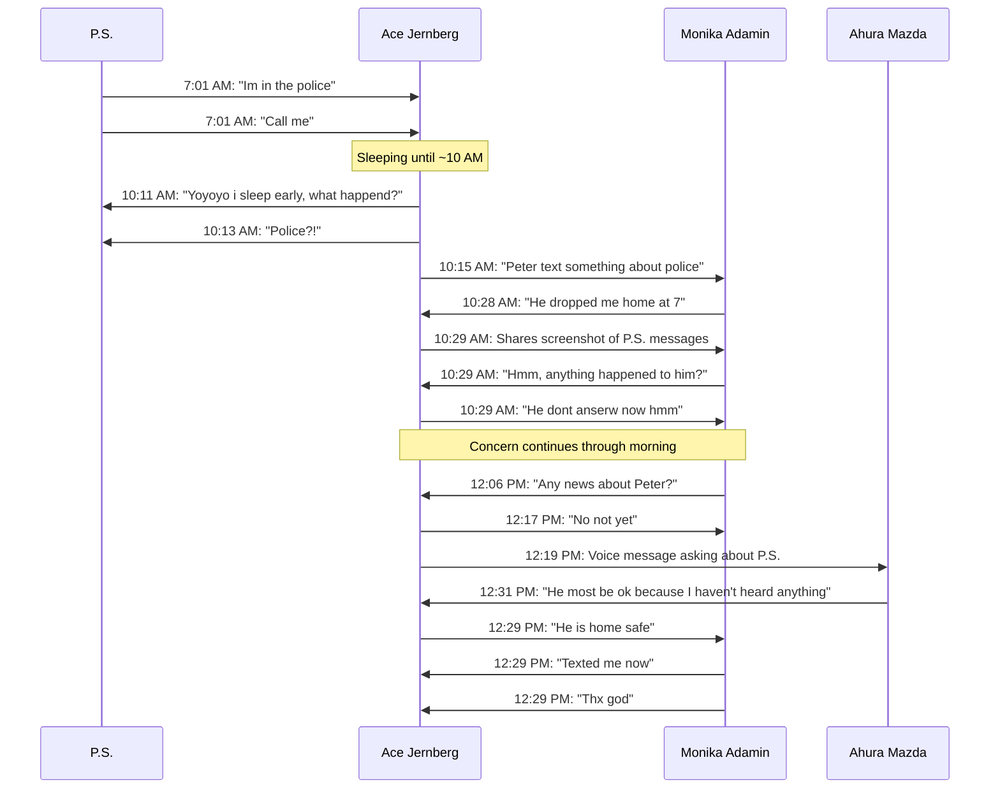
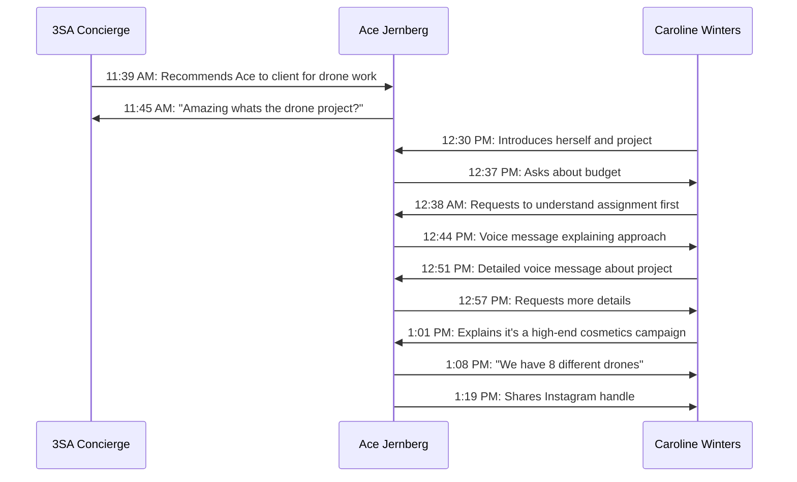
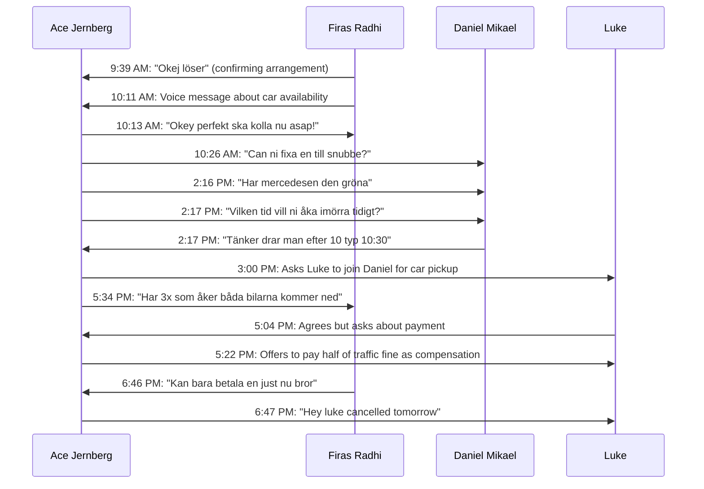

# WhatsApp Communication Intelligence: Ace Jernberg - March 2, 2025

## Executive Summary

Ace Jernberg's WhatsApp communications on March 2, 2025 reveal a dynamic business leader managing multiple simultaneous operations for Content Currency while navigating a day with several unexpected developments. The conversations demonstrate Ace's central role in coordinating projects across videography, AI solutions, and vehicle logistics, while maintaining relationships with team members, clients, and business partners. A significant situation involving P.S. being "in the police" early in the morning created a ripple effect of concern among multiple contacts, highlighting both the interconnected nature of Ace's network and potential improvements needed in emergency communication protocols.

## Team Dynamics & Communication Map

```mermaid
graph TD
    Ace((Ace Jernberg))
    
    %% Core Team
    Veli[Velislav - AI & Software]
    Casper[Casper - Videography]
    Danis[Danis Catering]
    
    %% Business Partners
    Firas[Firas Radhi - Car business]
    Jesus[Jesus Morales - Car photos]
    3SA[3SA Concierge]
    Mantelo[Mantelo Rentals]
    
    %% Others in Network
    PS[P.S. - Emergency situation]
    Monika[Monika Adamin]
    David[David Ballard]
    Caroline[Caroline Winters - Potential client]
    Daniel[Daniel Mikael]
    Luke[Luke - Car pickup]
    Kornelijus[Kornelijus - Car mechanic]
    
    %% Team Communication
    Ace <--> Veli
    Ace <--> Casper
    Ace <--> Danis
    
    %% Partners Communication
    Ace <--> Firas
    Ace <--> Jesus
    Ace <--> 3SA
    Ace <--> Mantelo
    
    %% Other Communication
    Ace <--> PS
    Ace <--> Monika
    Ace <--> David
    Ace <--> Caroline
    Ace <--> Daniel
    Ace <--> Luke
    Ace <--> Kornelijus
    
    %% Indirect Communications
    PS -.-> Monika
    3SA -.-> Caroline
    Daniel -.-> Luke
    
    %% Projects/Issues
    PSIssue[Emergency: P.S. at police]
    CarPickup[Project: Car pickup logistics]
    DroneProject[Potential project: Cosmetics shoot]
    CarPlates[Task: Change Range Rover plates]
    CarRepair[Task: Car reassembly for paint]
    MeetingFinca[Meeting at 19:30 at finca]
    
    %% Connect issues/projects
    Ace --- PSIssue
    Ace --- CarPickup
    Ace --- DroneProject
    Ace --- CarPlates
    Ace --- CarRepair
    Ace --- MeetingFinca
    
    %% Who's involved in what
    PSIssue --- PS
    PSIssue --- Monika
    CarPickup --- Firas
    CarPickup --- Daniel
    CarPickup --- Luke
    DroneProject --- Caroline
    DroneProject --- 3SA
    CarPlates --- Mantelo
    CarRepair --- Kornelijus
    MeetingFinca --- Danis
    MeetingFinca --- PS
```

## Task Delegation & Acceptance Analysis

| Task | Delegated To | Response/Acceptance | Status | Notes |
|------|-------------|---------------------|--------|-------|
| Car pickup from Murcia | Daniel & Luke | Accepted initially | Cancelled | Initially planned for 10:30AM trip, confusion about location (Granada vs Murcia), eventually cancelled |
| Reassembly of car for paint | Kornelijus | "Maybe tomorrow" | Scheduled | Car needs to be reassembled before going to Malaga for paint |
| Change license plates on Range Rover | Ace (self-assigned) | "Delivered" | Completed | Task from Mantelo.Rentals, Ace confirmed completion |
| Taking dog (Ruby) outside | Ace (from Danis) | "Yes" | Completed | Simple pet care task requested by Danis |
| Attending 19:30 meeting at finca | Ace & P.S. | Confirmed | Confirmed | Meeting arranged and confirmed with multiple parties |
| Car photoshoot with Jesus | Not delegated | Postponed | Rescheduled | Weather conditions prevented planned photoshoot |

## Information Flow Analysis

### Critical Situation: P.S. and Police Incident

This sequence highlights a significant communication bottleneck: Ace missing urgent messages while sleeping, leading to delayed response to a potentially serious situation and causing concern among multiple contacts.

### Business Development: Drone Project Opportunity

This interaction demonstrates Ace's business development approach, though reveals a potential mismatch in expectations: Caroline wanted to see portfolio work before discussing budget, while Ace initially focused on budget qualifying.

### Car Pickup Logistics Coordination 

This sequence reveals a complex coordination effort involving multiple parties that ultimately falls through. The changing parameters and final cancellation suggest potential inefficiencies in planning.

## Communication Challenges & Suggested Improvements

### 1. Emergency Response Protocol
**Issue:** Urgent messages from P.S. about police involvement went unanswered for several hours while Ace slept.
**Recommendation:** Implement an emergency notification system for urgent matters. This could include setting up specific contacts with priority notification settings that bypass "do not disturb" mode or designating a secondary contact for emergencies during off-hours.

### 2. Information Centralization
**Issue:** Information about P.S.'s situation was fragmented across multiple conversations, leading to repetitive inquiries.
**Recommendation:** When critical situations arise, create temporary group chats with all relevant parties to ensure everyone has access to the same information simultaneously, reducing redundant questions and confusion.

### 3. Project Management Structure
**Issue:** Car pickup arrangements involved multiple changing parameters across several conversations, leading to confusion and eventual cancellation.
**Recommendation:** Implement a more structured approach to project planning with clear documentation of requirements, responsibilities, and timelines accessible to all involved parties.

### 4. Client Communication Approach
**Issue:** Initial conversation with potential client Caroline Winters showed mismatched expectations about project qualification process.
**Recommendation:** Develop a standardized client onboarding approach that balances qualification with demonstration of capabilities, ensuring conversations follow a consistent and professional path regardless of which team member handles them.

### 5. Task Confirmation
**Issue:** Some tasks lack clear confirmation of completion (e.g., Kornelijus' response about car reassembly was tentative).
**Recommendation:** Implement a simple task tracking system requiring explicit confirmation of task acceptance, estimated completion time, and actual completion notification.

## Successful Collaboration Instances

### 1. Mantelo.Rentals License Plate Change
The request from Mantelo.Rentals to change plates on a Range Rover was handled efficiently, with Ace completing the task and confirming delivery, followed by Mantelo's acknowledgment. This straightforward task delegation and confirmation represented effective collaboration.

### 2. 3SA Concierge Client Referral
The referral from 3SA Concierge to Caroline Winters demonstrated effective networking and collaboration between business partners. 3SA recognized a client need that matched Ace's services and facilitated the connection appropriately.

### 3. David Ballard Key Handover
The coordination with David Ballard for key handover was smooth and efficient, with clear location sharing, prompt response, and confirmed completion. This represents effective handling of a simple logistics task.

## Conclusion

Ace Jernberg's WhatsApp conversations reveal a business leader at the center of a complex network of team members, clients, and partners. While his ability to manage multiple different operations simultaneously is evident, there are clear opportunities to improve communication efficiency, particularly around emergency situations, task delegation, and project coordination.

The communication patterns suggest a highly centralized information flow with Ace at the hub, which creates both strengths (cohesive direction) and vulnerabilities (potential bottlenecks when Ace is unavailable). Implementing more structured communication protocols and clearer task management systems would help distribute information flow more effectively and ensure critical matters receive appropriate attention regardless of timing.

By addressing these identified communication challenges, Content Currency could significantly enhance operational efficiency and team coordination while reducing the risk of miscommunications or missed opportunities.