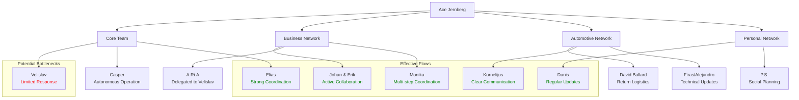

# Team Dynamics Analysis: Ace Jernberg's Communications (3/4/2025)

## Executive Summary

Analysis of Ace Jernberg's WhatsApp communications on March 4, 2025, reveals a complex network of business and personal relationships managed through a hub-and-spoke communication model. As the driving force behind Content Currency, Ace navigates multiple parallel conversations across different business domains while coordinating team activities, client relationships, and personal engagements. The day was characterized by several key business meetings, ongoing automotive projects, branding work, and various personal interactions, all managed simultaneously with varying degrees of responsiveness and clarity.

## Communication Network Mapping

### Core Business Team
- **Velislav** (AI/Software Engineering): Minimal substantive interaction despite multiple test messages; appears to be working on logo design for client A.Ri.A
- **Casper** (Videography): Brief check-in during evening; limited conversation suggesting autonomous operation
- **Elias** (Business Partner): Strong coordination regarding 18:00 meeting with Johan and Erik; handled Google Meet setup

### Client & Business Network
- **Johan & Erik Wikström**: Important business meeting at 18:00 regarding potential venture ("The Plug" based on shared pitch deck)
- **A.Ri.A** (Mfinity): Client expecting logo designs from Velislav
- **Kornelijus**: Automotive specialist who completed work on a Lamborghini; planned evening meetup at garage
- **Toñi Rmm Consulting**: Administrative contact requesting invoices (received minimal response)
- **Monika Adamin**: Facilitator requesting escort service for clients; multi-step coordination executed

### Automotive & Property Network
- **Firas Radhi**: Discussion about car condition (brakes/gasoline issues)
- **Daniel Mikael**: Shared personal story about neighbor damaging his BMW; coordinated key handover
- **David Ballard**: Car return logistics coordinated through Daniel
- **Pippa Jones**: Brief property-related exchange about "square meters build"
- **Pedro Moreno**: New insurance contact for BMW Z3
- **Alejandro Morback**: Car modification specialist (mentioned April 21 deadline)

### Personal Connections
- **Danis**: Close personal relationship with ongoing domestic coordination; evening meetup
- **P.S.**: Friend arranging training session for tomorrow and dinner plans for Thursday
- **Annette**: Family/personal conversation including debate about recreational substance use

## Information Flow Analysis

## Task Delegation & Acceptance Analysis

| Task | Delegated To | Communication Quality | Outcome |
|------|-------------|---------------------|---------|
| Google Meet Setup | Elias | Clear, direct request | ✅ Completed effectively |
| Logo Design for A.Ri.A | Velislav | Indirect (mentioned in group chat) | ⏳ In progress; promised delivery |
| Escort Service Arrangement | Jack → 3rd party | Multi-step coordination | ✅ Completed successfully |
| Car Key Handover | Daniel → David | Clear connection facilitation | ✅ Completed successfully |
| Invoice Preparation | Ace (from Toñi) | Incomplete response | ❓ Unclear resolution |

## Potential Miscommunications & Unacknowledged Messages

1. **Velislav's Test Messages**: Multiple test messages throughout the day received minimal acknowledgment, potentially indicating technical issues or communication gaps.

2. **Invoice Request from Toñi**: Request for January and February invoices was met with a brief audio message claiming they were already sent - lacks clear resolution or confirmation.

3. **Property Information with Pippa Jones**: Brief exchange about "square meters build" lacked context and clear conclusion.

4. **Alejandro's April 21 Deadline**: The significance of this date (likely car-related) was acknowledged with "Omg" but without substantive follow-up.

## Chronological Day Overview

### Morning (8:00 AM - 12:00 PM)
- Car mechanical issues discussed with Firas
- Meeting scheduled with Erik Wikström for 18:00
- Car return logistics coordinated with David Ballard
- Garage evening meetup planned with Kornelijus

### Afternoon (12:00 PM - 5:00 PM)
- Coordinated escort service for Monika's client
- Brief property discussion with Pippa Jones
- Minimal response to invoice request from Toñi
- Meeting preparation with Elias for 18:00 call
- Social planning with P.S. for training and dinner

### Evening (5:00 PM - 10:00 PM)
- 18:00 Business meeting with Johan and Erik (regarding "The Plug")
- Logo design follow-up for client A.Ri.A
- Car insurance introduction from Pedro Moreno
- Evening meetup coordinated with team members (shared location pins)
- Personal meetup with Danis

## Successful Collaboration Instances

1. **The 18:00 Business Meeting**: The full cycle from scheduling to execution and follow-up (including shared pitch deck) demonstrates effective coordination between Ace and Elias.

2. **Automotive Project Completion**: Kornelijus's update about finishing the Lamborghini work and subsequent meetup arrangement shows clear project completion communication.

3. **Client Service Fulfillment**: The multi-step process of arranging an escort service for Monika's client demonstrated effective network utilization and service delivery.

4. **Car Return Process**: Efficiently coordinated the return process for David Ballard's car by connecting him with Daniel for key handover.

## Recommended Coordination Improvements

1. **Implement Structured Acknowledgment Protocol**: Establish clear expectations for message acknowledgment, especially for time-sensitive requests.

2. **Create Context-Rich Communication**: Provide more background information when delegating tasks to ensure team members understand priorities and expectations.

3. **Develop Direct Team Connections**: Facilitate more direct communication between team members to reduce reliance on Ace as an information conduit.

4. **Implement Regular Team Syncs**: Schedule brief daily updates to ensure all team members understand current priorities and projects.

5. **Enhance Follow-Up Mechanisms**: Establish clearer processes for tracking open items and unresolved requests to prevent issues from falling through cracks.

6. **Centralize Project Information**: Consider implementing a shared project management tool to reduce reliance on WhatsApp for critical business information.

## Conclusion

Ace Jernberg effectively manages a diverse and complex network of business and personal relationships through a centralized communication model. While most interactions demonstrate clear purpose and effective outcomes, the high volume of parallel conversations creates potential bottlenecks and occasional gaps in response thoroughness.

The most successful collaborations occur when clear delegation and prompt follow-up are present, particularly with established team members like Elias and service providers like Kornelijus. Opportunities for improvement exist in standardizing communication protocols, enhancing context-sharing, and reducing reliance on Ace as the sole information conduit between team members.

This communication analysis reveals a business leader who effectively bridges multiple domains while maintaining comprehensive awareness of operations, but who could benefit from more structured communication processes as the organization continues to grow.